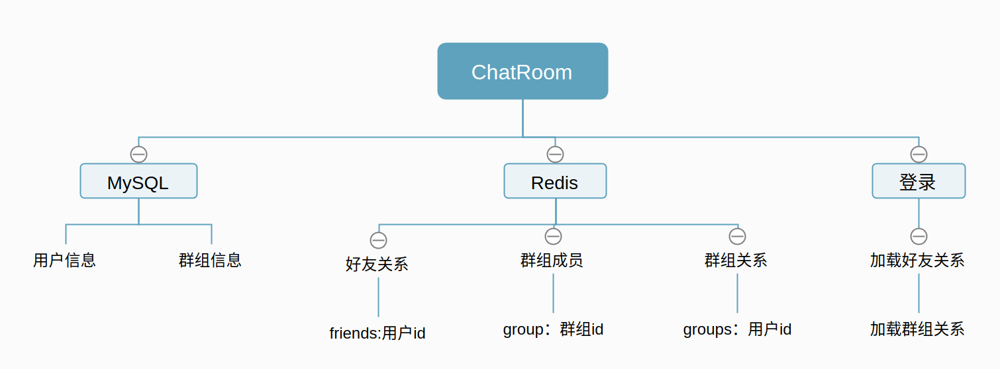

# 基于Netty实现的WebSocket的互联网聊天系统

[Spring整合Netty、WebSocket的互联网聊天系统](https://segmentfault.com/a/1190000015681145#articleHeader11) 的SpringBoot实现版本

## 待完成部分

目前还不能与前端对接，之后对前端代码重构

* ~~数据库部分(完成)~~
* 事务
* 添加好友
* 前后端分离
* Netty性能压力测试
* Netty高并发调优

---

## 数据库设计

MySQL部分也可以用Redis来储存。

好友与群组关系存放在Redis中，保证了前端获取数据时的速度。
暂无根据时间排序需求，故用set类型储存，可根据字典序排列。目前这部分数据存在冗余。

Redis客户端使用了Springboot2.0版本以后默认的Lettuce

[Lettuce对比Jedis的优势](https://github.com/spring-projects/spring-session/issues/789)